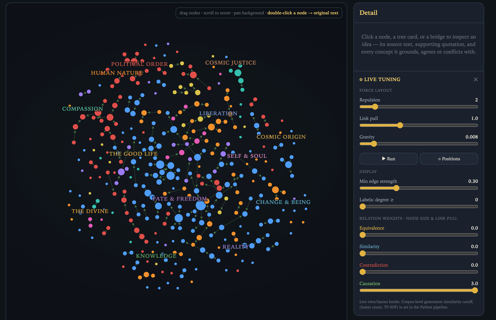

# Philosophy Taxonomy



A reproducible, dependency-light pipeline that turns the sources listed in
[`index.html`](index.html) into an interactive map of ancient thought,
[`taxonomy.html`](taxonomy.html).

It (1) **downloads** every listed source in a uniform format, (2) breaks the corpus
into **sentence-level elements** and distils atomic concepts/rules, (3) identifies
**similarity / equivalence / contradiction** between ideas plus curated directed
**causal grounding** links, and (4) **visualizes** the clusters as an interactive
constellation + a hierarchical taxonomy.

## Run it

```bash
python3 pipeline/pipeline.py                 # full run (downloads sources)
python3 pipeline/pipeline.py --no-download   # reuse data/raw, rebuild stages 2–4
python3 pipeline/pipeline.py --only 3        # re-run a single stage
```

Then open **`taxonomy.html`** in a browser (self-contained — no server needed).

Requirements: Python 3.9+, `numpy`, `requests`. No other third-party packages
(TF-IDF, cosine similarity and agglomerative clustering are implemented in
`stage3_relations.py`; HTML parsing & sentence segmentation are in `util.py`).

## Stages & outputs

| # | Script | Does | Writes |
|---|--------|------|--------|
| 1 | `stage1_download.py` | Parses the `<a class="src">` links out of `index.html`, downloads each unique URL with a browser UA, strips it to plain text. | `data/sources.json`, `data/downloads.json`, `data/raw/<id>.{html,txt}` |
| 2 | `stage2_elements.py` | Segments the whole corpus into clean prose **sentences**; emits the curated **elements** (concept/claim/rule/method), each enriched with civ/school/native name, a link to the original text, and supporting sentences pulled from the downloaded corpus as *evidence*. | `data/sentences.json`, `data/elements.json` |
| 3 | `stage3_relations.py` | Builds a TF-IDF vector per element, computes the cosine matrix, and classifies every pair as **equivalence / similarity / contradiction**; adds the curated directed **causation** edges; runs **agglomerative clustering** and a **force-directed layout**. | `data/relations.json`, `data/graph.json` |
| 4 | `stage4_taxonomy.py` | Merges everything, computes cross-cultural **bridges** and **debates**, injects the payload into `taxonomy_template.html`. | `data/taxonomy.json`, `../taxonomy.html` |

`knowledge.py` holds the curated knowledge base: the **themes**, the **elements**, the
**stance** of each element, the documented **oppositions** and **causal chains**, and
the thinker → original-text map.

## Uniform data schemas

**element** (`data/elements.json`)
```json
{
  "id": "heraclitus.flux", "text": "Everything flows; you cannot step twice into the same river.",
  "type": "concept", "theme": "change", "theme_label": "Change, Permanence & Becoming",
  "stance": "flux", "thinker": "Heraclitus", "thinker_native": "Ἡράκλειτος",
  "civ": "Greece", "school": "Ionian", "source_url": "https://en.wikisource.org/wiki/Fragments_of_Heraclitus",
  "keywords": ["change","flux","river",...], "quote": "πάντα ῥεῖ",
  "evidence": [{"text":"You cannot step twice into the same rivers…","source_url":"…"}]
}
```

**relation** (`data/relations.json`)
```json
{ "s": "democritus.atoms", "t": "carvaka.materialism", "type": "equivalence",
  "score": 0.31, "rationale": "shared stance “materialist” on reality" }
```

## How relations are decided

* **similarity** — discovered automatically: high TF-IDF cosine between two elements of
  *different* stance (top-k per node above a threshold).
* **equivalence** — two elements share a theme **and** the same `stance` (cross-cultural
  agreement, e.g. the Golden Rule in Confucius and Leviticus).
* **contradiction** — opposed stances on a shared theme (per `OPPOSITIONS`), or a lexical
  **antonym cue**, or a documented cross-theme debate (`CROSS_CONTRA`).
* **causation** — curated, *directed* cause → effect links (`CAUSATION`) marking where a
  thinker derives one doctrine from another within a tradition (e.g. Epicurus: atoms and
  void → death is nothing to fear → ataraxia). Drawn with green arrowheads.

The `stance` labels encode mainstream scholarly readings so that *agreement* and
*disagreement* can be separated; the cosine similarity and clustering are fully
unsupervised. The two are cross-checked: stage 3 reports how well the unsupervised
clusters recover the curated themes.

## Caveats

The element set is a curated distillation, not an exhaustive extraction — distilling
clean propositions from archaic, multilingual translations is itself unsolved. Dates,
attributions and especially the *stance* oppositions are simplified for legibility;
they are a defensible starting map, not the last word. Every node links back to the
original text so claims can be checked at the source.
